#  Hi, Welcome back 

<div style="margin-top: 20px;">

<!-- 


 -->


_កម្មករសរសេរកូដ_ 😂 _(Vibe Coder • Vibe Designer)_

I am a Senior Front-End Developer at _TURBOTECH CO,.LTD_ also as a Open Source _Vibe (Coder/Designer)_ with a huge love for Node.js, Next.js, Nuxt.js, PostgreSQL, REST API and Data Visualization.

- 🌱 I'm currently learning many things, I believe that everyday is a learning opportunity.
- 🧑‍💻 Passionate about coding and open source projects
- 🎨 Lover of design and user experience
- 💖 Explorer of new technologies and frameworks
- 💻 Visit my [Portfolio](https://pphat.me) for more details about me.

## 🍳 Most used tech stacks

<br>
<div>


</div>

## 🥗 Most tech stack used yesterday

<div align="left">

<!--START_SECTION:daily-->
```diff
███████████░░░░░░░░░░░░░░ ⁝ 43.83% • Blade Template
████████░░░░░░░░░░░░░░░░░ ⁝ 30.39% • PHP
██░░░░░░░░░░░░░░░░░░░░░░░ ⁝ 9.21% • Markdown
██░░░░░░░░░░░░░░░░░░░░░░░ ⁝ 6.89% • Vue
█░░░░░░░░░░░░░░░░░░░░░░░░ ⁝ 3.54% • TypeScript
█░░░░░░░░░░░░░░░░░░░░░░░░ ⁝ 3.32% • JavaScript
█░░░░░░░░░░░░░░░░░░░░░░░░ ⁝ 2.56% • JSON
░░░░░░░░░░░░░░░░░░░░░░░░░ ⁝ 0.12% • Python
░░░░░░░░░░░░░░░░░░░░░░░░░ ⁝ 0.1% • CSS
░░░░░░░░░░░░░░░░░░░░░░░░░ ⁝ 0.04% • Bash
░░░░░░░░░░░░░░░░░░░░░░░░░ ⁝ 0.01% • Git
░░░░░░░░░░░░░░░░░░░░░░░░░ ⁝ 0.0% • Other
```
<!--END_SECTION:daily-->

</div>

## 🌟 Daily commitment



<br>

## 🧪 Most coding language 




## ✨ Hello new friends

<div>
<!--START_SECTION:followers-->

- [ahmadrizal-baihaqi](https://github.com/ahmadrizal-baihaqi)
- [duncuo164](https://github.com/duncuo164)
- [cachewraith](https://github.com/cachewraith)
- [Dvurechensky](https://github.com/Dvurechensky)
- [standardgalactic](https://github.com/standardgalactic)
- [Angkor-Rhapsody](https://github.com/Angkor-Rhapsody)
- [RaksaOC](https://github.com/RaksaOC)
- [phanithphan](https://github.com/phanithphan)
<!--END_SECTION:followers-->
</div>

<br>

